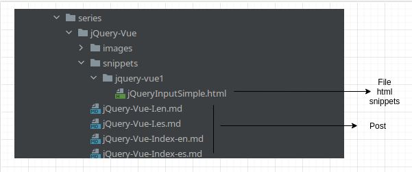
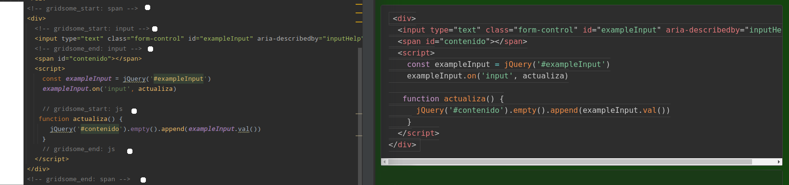

# gridsome-remark-embed-code

### plugin para Gridsome que permite la integración de código desde archivos externos en documentos markdown.


#### El problema

* Markdown (grisome-remark) renderiza perfectamente el código que necesitaba renderizar. No obstante: 
  * Se necesita poner el código contenido en el markdown lo que podría llevar a errores semánticos o de tabulación mas sencillos de controlar con un ide y el código fuente.
  * Es tedioso repetir ese contenido, que no cambia, para hacer una web de varios idiomas.
* El plugin existente [gridsome-remark-embed-snippet](https://github.com/mrinalini-m/gridsome-remark-embed-snippet):
  * Pide un archivo por código a incluir. Tengo artículos con mucho código integrado lo que me supondría crear bastantes archivos de referencia
  * Toma el lenguaje de la extensión del archivo. Si creaba un archivo completo de html + css + js para ejemplos completos el lenguaje no asociado a la extensión (css, js) seria difícil de distinguir
  * A pesar de esos detalles es el código que se tomo como base para la creación de este plugin. Desde aquí gracias a su creadora.

### La solución propuesta:

* Un plugin capaz de obtener el código de parte de un archivo y mostrarlo en el markdown.
  * Se marca en el archivo el inicio y final del código. 
    * Las marcas son configurables.
    * Se tomara la linea siguiente a la marca inicial hasta la linea anterior a la marca final
    * Se permite tener infinitas marcas en el código. Por eso se necesita aun nombre único para cada una.
    * Se permite anidamiento. Las marcas anidadas serán saltadas cuando se solicite marcas padre.
    * Se permiten varios formatos posibles
    * Se puede seleccionar el lenguaje para una correcta renderización.
  * Se puede configurar un directorio por defecto. Se puede usar una ruta absoluta o una ruta relativa.
    * Aun existiendo la ruta por defecto se puede hacer referencia a un path (a partir de esa ruta o de forma absoluta) hasta el archivo destino


### Instalación

**¡¡Cuidado!!**: Este plugin depende del plugin [@gridsome/transformer-remark](https://github.com/gridsome/gridsome/tree/master/packages/transformer-remark).

```bash
npm install gridsome-remark-embed-code
yarn add gridsome-remark-embed-code
```

#### Configuración básica.

El plugin debe estar **antes** del plugin de **@gridsome/remark-prismjs** en la configuración del **gridsome.config.js** para funcionar correctamente.

Esto es porque el **primjs** transpilara el código markdown a html y entonces se perderán las marcas necesarias para que el plugin funcione.

Ejemplo:

```javascript
transformers: {
  remark: {
   ...
    plugins: [
        'gridsome-remark-embed-code',
        ....
        '@gridsome/remark-prismjs',
      ....
    ]
  }
}
```

#### Funcionamiento básico:

Estructura de carpetas de ejemplo.



Usando esta estructura de ejemplo el código agregado en nuestro markdown seria:

```
`embed: ./snippets/jquery-vue1/jQueryInputSimple.html#input`
```

#### Explicación:

Embed es la palabra clave para indicar que se va a embeber contenido. 

Luego se escribe el camino y el nombre del archivo.

`#input` es una referencia a un trozo de código marcado en el archivo: 

```html
  <!-- gridsome_start: input -->
  <input type="text" class="form-control" id="exampleInput" aria-describedby="inputHelp">
  <!-- gridsome_end: input -->
```

El markdown procesara: 

```html
<input type="text" class="form-control" id="exampleInput" aria-describedby="inputHelp">
```


### Avanzado. Uso. Configuración. Personalización.

El plugin permite configurar 8 parámetros y usa 9 en total.

#### Configuración de un plugin en Gridsome:

Cuando pasamos parámetros a un plugin en **gridsome** la forma de escribirlo en el **gridsome.config.js** cambia levemente:

```javascript
transformers: {
  remark: {
   ...
    plugins: [
        [
            'gridsome-remark-embed-code',
            {
                parameter: value
            }
         ],
        ....
        '@gridsome/remark-prismjs',
      ....
    ]
  }
}
```

#### Parámetros usados en el markdown:

* **embed**: Es la palabra clave para indicar el uso del plugin. Es configurable de la siguiente forma:

__embedKey: string__ // donde string es cualquier palabra valida. Esto significa que no se deben usar espacios.

Ejemplo visual (para no ser repetitivos en los siguientes parámetros obviaremos el ejemplo visual)

 ```javascript
transformers: {
  remark: {
   ...
    plugins: [
        [
            'gridsome-remark-embed-code',
            {
                embedKey: 'miembed'
            }
         ],
        ....
        '@gridsome/remark-prismjs',
      ....
    ]
  }
}
 ```

Esta configuración cambiaría el código antes mostrado de la siguiente forma;

```
`miembed: ./snippets/jquery-vue1/jQueryInputSimple.html#input`
```

* **Lang: string** // El lenguaje a utilizar. Se recomienda seguir la lista siguiente: [highlight.js](https://github.com/highlightjs/highlight.js/blob/master/SUPPORTED_LANGUAGES.md)

  Ejemplo:

  **Lang: html**

```
`embed: ./snippets/jquery-vue1/jQueryInputSimple.html#input Lang: html`
```

No es necesario si el lenguaje coincide con la extensión del archivo.

* **Separator: 'symbol' || 'key'** // por defecto y cuando la palabra no se entiende es **'symbol'**

Este parámetro es como se indica el nombre del snippet a traer. En ejemplos  anteriores hemos visto el siguiente código:

````
`embed: ./snippets/jquery-vue1/jQueryInputSimple.html#input`
````

donde **#input** es el nombre del snippet. Eso es la configuración por defecto seleccionado **separator** como **symbol**. Si se usa la opción de clave (**key**) cambiaría de la siguiente forma:

```
`embed: ./snippets/jquery-vue1/jQueryInputSimple.html{input}`
```

con una clave de inicio y una clave final para poder colocar el nombre del snippet.

Tanto **key** como **symbol** permiten configurar los caracteres a usar.  En el caso de elegir **symbol** el valor modificable del carácter es **separatorSymbol**. Y en el caso de seleccionar **key** los valores de los caracteres son **separatorKeyStart** y **separatorKeyEnd**.

La configuración por defecto es: 

```javascript
[
            'gridsome-remark-embed-code',
            {
                separator: 'symbol',
                separatorSymbol: '#'
            }
         ],
```

***<u>No se hacen correcciones buscando posibles conflictos con caracteres alfanuméricos o posibles caracteres usados en rutas y nombres de archivos. Usar tales caracteres rompería el funcionamiento. Recomendamos sentido común.</u>***

Un parámetro que no se usa dentro del markdown pero que lo afecta  directamente es: 

* **subdirectory: string** => El directorio por defecto donde empezar a buscar el archivo con los snippets. El archivo puede ser relativo poniendo el punto antes de la primer barra, o absoluto al sitio obviando ese detalle. Por defecto no hay directorio definido.

Dentro del archivo que contiene los snippets hablamos antes del formato siguiente: 

```html
  <!-- gridsome_start: input -->
  <input type="text" class="form-control" id="exampleInput" aria-describedby="inputHelp">
  <!-- gridsome_end: input -->
```

Las palabras clave son configurables con los parámetros **startKey** y **endKey** por defecto son:

**startKey: 'gridsome_start'**

**endKey: 'gridsome_end'**

Los snippets permiten anidación infinita.

En definitiva la configuración siguiente: 

```javascript
transformers: {
  remark: {
   ...
    plugins: [
        'gridsome-remark-embed-code',
        ....
        '@gridsome/remark-prismjs',
      ....
    ]
  }
}
```

es igual a:

```javascript
transformers: {
  remark: {
   ...
    plugins: [
        ['gridsome-remark-embed-code',
         {
             embedKey: 'embed',
             separator: 'symbol',
             separatorSymbol: '#',
             startKey: 'gridsome_start',
             endKey: 'gridsome_end',
             subdirectory: ''
         }
         ]
        ....
        '@gridsome/remark-prismjs',
      ....
    ]
  }
}
```

###  Espacios y marcas de comentarios.

Los snippets marcados en el archivo con el código no tienen porque estar en un comentario o puede usarse cualquier tipo de comentario. Esta desicion permite que se pueda usar cualquier formato de archivo, Por ejemplo: una lista de snippets en .txt o sino cualquier archivo de cualquier lenguaje que el markdown entienda que es código.

#### Valido

```txt
gridsome_start: namesnippet
code
gridsome_end: namesnippet
```

```
// /* <!-- (o cualquier formato de comentario) gridsome_start: namesnippet --> */ 
code
// /* <!-- gridsome_end: namesnippet --> */
```

Las marcas deben estar en una linea que no contenga código ya que el plugin elimina la linea completa de la marca y las de los snippets anidados en caso de existir.

La idea principal es conservar la integridad del archivo completo con el código sin tener que ir recortando partes de el para un articulo o serie de artículos extensos.

Se ha intentado dar vía libre a los espaciados para evitar un formato demasiado exigente.  Las siguientes formas son igualmente validas:

```
`embed: ./snippets/jquery-vue1/jQueryInputSimple.html  #input Lang: html`
```

```
`embed: ./snippets/jquery-vue1/jQueryInputSimple.html#input Lang:html`
```

```
`  embed:   ./snippets/jquery-vue1/jQueryInputSimple.html  #input Lang:    html `
```

 ### Renderización



En la imagen esta en blanco lo que se elimina  automáticamente. Las marcas de inicio y final, las marcas anidadas y el espacio a la derecha anterior al primer carácter de la primer linea conservando las tabulaciones.

### Colaboración.

Problemas, comentarios, mejoras, adaptaciones, etc. esta abierto a través de las issues. PR serán bienvenidos con el comentario adecuado y/o la documentación.
